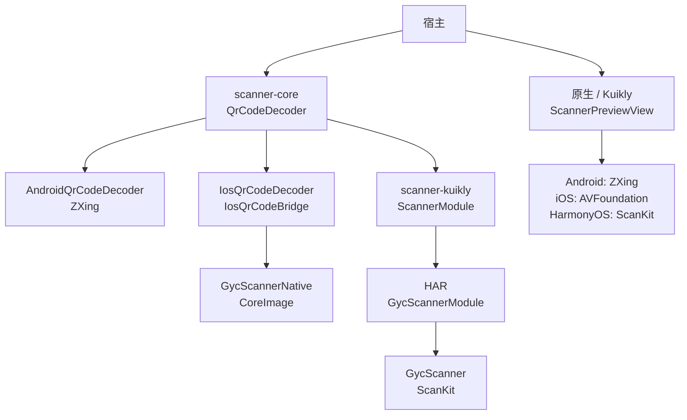
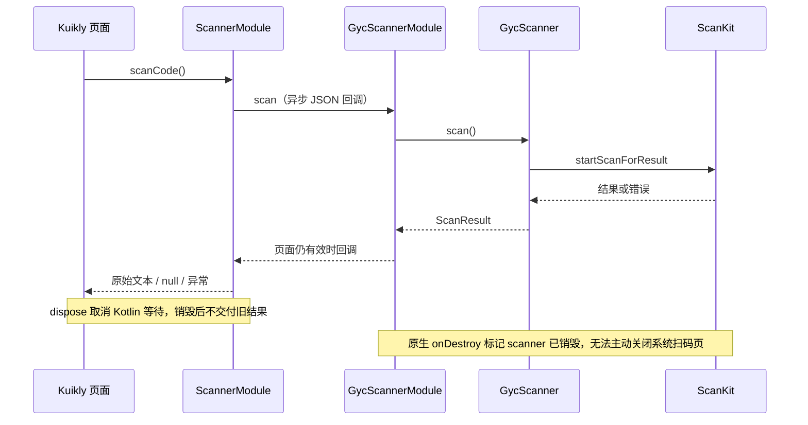
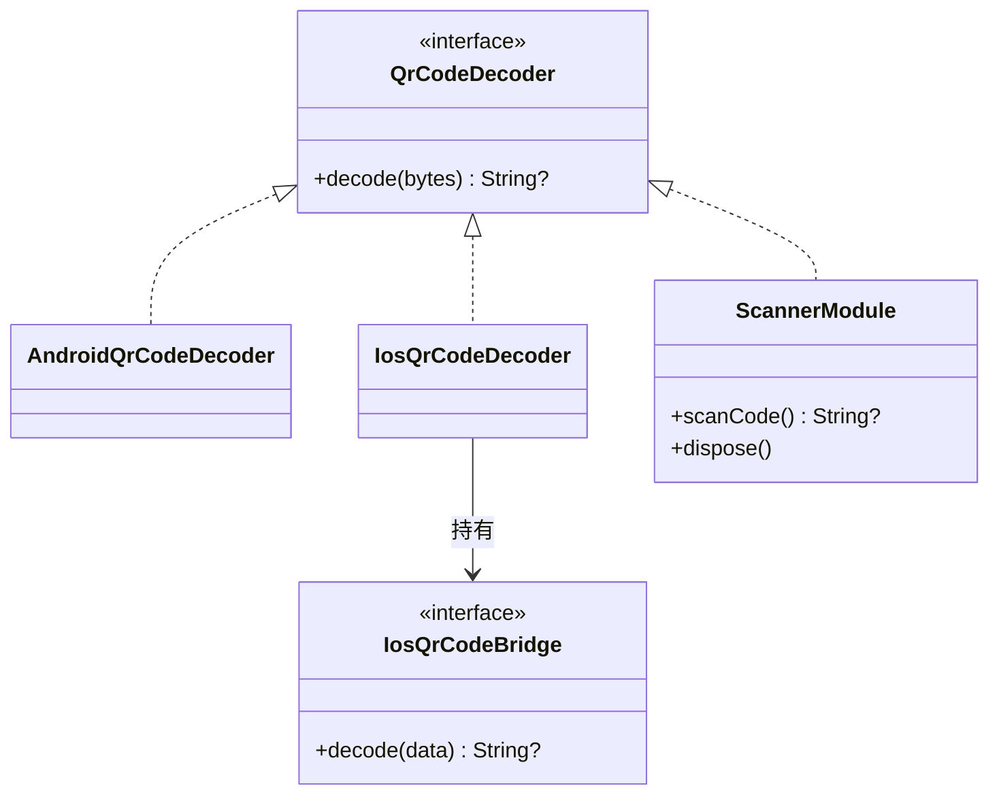

# GY CrossKit Scanner

## 当前功能与平台边界

core 提供图片 QR 解码及 Android 原生预览，Swift 提供 CoreImage/AVFoundation；scanner-kuikly 确有三端 ScannerPreviewHost UI入口，系统扫码页仅 OHOS。

适用版本：Maven 0.1.9；Swift Package 0.1.8；HAR 0.1.4。远程验收以固定 Release 结果为准。本次修复与平台边界见[功能与平台差异](docs/功能与平台差异.md)，构建与渠道验收见[版本发布记录](https://github.com/gycrosskit/scanner/releases/tag/0.1.9)；下方旧版本记录保留其历史范围。

当前测试覆盖、执行时点和未验收项集中见[验证范围](docs/功能与平台差异.md#验证范围)，复现命令见[开发与验证](docs/开发与验证.md)。

当前鸿蒙预览 ROI 的结果坐标沿 ViewControl 输入单位，不重复 px2vp；与 iOS 一致接受正面积相交，缺少位置或无效矩形继续扫描。配套 HAR `0.1.4` 包含此能力。

Kuikly Compose `ScannerPreviewHost`（Android/iOS/OHOS）提供共用反馈入口；当前包含 32 MiB 输入边界和默认 260 识别框。相机和视觉一致性仍须宿主及设备验收；历史发布与 ROI 候选记录见下方导航。

[历史完整源码审查](docs/完整源码审查.md) 列出全部生产文件、公开调用链、实际验证与未测项。

二维码图片解码、Android/iOS 原生相机预览和 HarmonyOS ScanKit 系统扫码。返回原始文本；业务格式校验、扫码框、提示、导航和图片选择由宿主负责。

## 平台与要求

| 平台 | 接入方式 | 系统要求 |
| --- | --- | --- |
| Android | KMP `scanner-core`，ZXing 图片解码与原生预览 | API 24+ |
| iOS | KMP 解码 bridge，或 Swift Package `GycScannerNative` | iOS 15+，Swift tools 5.9 |
| HarmonyOS | 原生 HAR，或 `scanner-kuikly` + HAR | 当前 HAR 的 target/compatible SDK 均为 API 22；需要设备提供 ScanKit |

Android/iOS/HarmonyOS 提供嵌入式预览；HarmonyOS 另提供系统扫码页。纯 OpenHarmony 设备不保证有 ScanKit，失败返回 `failed`。KMP 使用 Kotlin `2.2.21-1.0.0`，Kuikly 使用 `2.28.0-2.0.21-ohos`；OHOS 工具链配置见接入指南。

## 架构与调用流程

图片解码与相机预览是两个入口。`scanner-core` 提供 KMP 解码契约；iOS 由宿主接线 Swift bridge，HarmonyOS Kuikly 通过 HAR 调用 ScanKit。嵌入式预览按顶部当前功能合同和接入指南接线。



以下是 HarmonyOS 系统扫码页的调用，不是嵌入式预览。用户取消返回 `null`，设备或 SDK 失败进入错误出口；系统扫码页不能被组件强制关闭。



类图聚焦图片解码；`ScannerModule` 另外提供系统扫码入口，预览 View 独立维护相机生命周期。



源码：[QrCodeDecoder](scanner-core/src/commonMain/kotlin/io/github/gycrosskit/scanner/QrCodeDecoder.kt)、[Android 解码](scanner-core/src/androidMain/kotlin/io/github/gycrosskit/scanner/AndroidQrCodeDecoder.kt)、[iOS 解码与 bridge](scanner-core/src/iosMain/kotlin/io/github/gycrosskit/scanner/IosQrCodeDecoder.kt)、[Swift 解码](iosApp/Sources/GycScannerNative/QrCodeDecoder.swift)、[ScannerModule](scanner-kuikly/src/commonMain/kotlin/io/github/gycrosskit/scanner/kuikly/ScannerModule.kt)、[HAR Module](ohos/scanner-native/src/main/ets/GycScannerModule.ets)、[GycScanner](ohos/scanner-native/src/main/ets/GycScanner.ets)。预览：[Android](scanner-core/src/androidMain/kotlin/io/github/gycrosskit/scanner/ScannerPreviewView.kt)、[iOS](iosApp/Sources/GycScannerNative/ScannerPreviewView.swift)、[Kuikly](scanner-kuikly/src/commonMain/kotlin/io/github/gycrosskit/scanner/kuikly/ScannerPreviewView.kt)、[HAR](ohos/scanner-native/src/main/ets/GycScannerPreviewView.ets)。

## 安装

```kotlin
// settings.gradle.kts
dependencyResolutionManagement {
    repositories {
        exclusiveContent {
            forRepository {
                maven("https://mirrors.tencent.com/nexus/repository/maven-tencent/")
            }
            filter { includeGroup("com.tencent.kuikly-open") }
        }
        maven("https://jitpack.io")
        maven("https://maven.eazytec-cloud.com/nexus/repository/maven-public/")
        google()
        mavenCentral()
    }
}
```

```kotlin
commonMain.dependencies {
    implementation("com.github.gycrosskit.scanner:scanner-core:0.1.9")
}
ohosArm64Main.dependencies {
    implementation("com.github.gycrosskit.scanner:scanner-kuikly:0.1.9")
}
```

iOS 在 Xcode 的 Package Dependencies 添加 `https://github.com/gycrosskit/scanner.git`，选择精确版本 `0.1.8`，产品 `GycScannerNative`。

HarmonyOS 原生包独立安装：

```sh
ohpm install @gycrosskit/scanner-native@0.1.4
```

2026-10-07 官方公共 Registry metadata 已包含精确版本 `0.1.3`（当时预览 UI 所需 HAR）；全新 cache 的精确 Registry 下载/安装仍在独立验证中。历史验收中 NOTFOUND 是对应时间的记录。

## 最小使用

```kotlin
import io.github.gycrosskit.scanner.*

// 协程内解码图片；未识别或无效图片返回 null，取消继续传播。
val text = AndroidQrCodeDecoder.decode(imageBytes)
// 主线程创建；先获得 CAMERA 权限。
val preview = ScannerPreviewView(activity, onFailure = { error ->
    // 宿主展示失败。
}) { rawText ->
    // 宿主校验并使用原始文本。
}
preview.setRunning(true)
// 页面离开或应用进入后台：
preview.setRunning(false)
// 页面永久销毁：
preview.release()
```

iOS 使用 `QrCodeDecoder.decode(data:)` 和 `ScannerPreviewView`；HarmonyOS 使用 `GycScanner(context).scan()` / `decode(bytes)`。平台完整示例见接入指南。

## 权限与边界

宿主先申请相机权限；Android CAMERA 声明由 AAR 合并，iOS Info.plist 需填写 `NSCameraUsageDescription`。预览主线程操作，一次启动只返回一个结果，继续扫描由宿主显式启动。Android/iOS 退出页面或后台时暂停，销毁时释放相机。

HarmonyOS 同实例只允许一个系统扫码请求；销毁时 `dispose()` 取消挂起回调。ScanKit 无主动关闭系统扫码页的接口；图片解码临时文件在 finally 清理，桥接图片上限 32 MiB，Base64 会额外占用内存。

不提供一维条码、多码选择、连续扫描、独立图片选择器或状态栏修改。编译与契约检查不代替真实设备相机、权限拒绝、前后台切换和二维码识别验收。

## 文档与帮助

- [接入指南](docs/接入指南.md)：平台初始化、权限声明和生命周期。
- [开发与验证](docs/开发与验证.md)：源码构建、检查命令与验收范围。
- [M13 候选验收](verification/嵌入式扫码候选验收.md)：本地测试、完整归档与未验收边界。
- [版本与发行说明](https://github.com/gycrosskit/scanner/releases)、[问题反馈](https://github.com/gycrosskit/scanner/issues)。

Apache-2.0，见 [LICENSE](LICENSE)。

## 历史发布记录

以下记录保留对应版本、渠道与验收时点，不替代顶部当前功能和安装基线。

- [0.1.7 iOS ROI 候选记录](docs/0.1.7-iOS-ROI候选.md)、[0.1.6 跨端行为与后续发布记录](docs/跨端行为候选.md)。
- <a id="015-prerelease"></a>[0.1.5 远程发布验收](docs/0.1.5远程发布验收.md)。
- <a id="014-prerelease"></a>[0.1.4 发布验收](docs/发布验收-0.1.4.md)。
- <a id="013-prerelease"></a>[0.1.2 安装失败与 0.1.3 嵌入式预览/API/远程验收](verification/嵌入式扫码候选验收.md)。

## 自动回归

[Component regression](.github/workflows/regression.yml) 按事件分阶段：PR 先判断变更范围，仅源码变更运行已有 Android/Native 测试与编译；纯文档 PR 和 `main` push 只运行轻量脚本/配置检查。手动运行不填版本时执行源码回归，未知路径保守按源码处理。源码 PR 执行验收，main 保持轻量检查，Release 验证精确远程坐标与消费者；线上耗时以实际 Actions 运行为准。

Maven Release 发布或手动填写精确已发布版本时，`verify-public` 统一校验一次冻结归档、精确 tag/commit、完整 publication 清单和公开文件；通过后 Android/Native 独立消费者从 JitPack 解析该版本。PR 不再反复消费旧基线；不使用 `mavenLocal`、本库源码或归档替换远程依赖。此流程不发布二进制。

OHOS KLIB 编译不代表 HAR 构建、ohpm 上架或真机验收。当前没有已确认可用的 DevEco/Hvigor runner，这些检查尚未自动化，不能作为 CI 通过范围。

阶段、缓存、有限网络重试、失败记录与证据边界见[共用 CI 规则](https://github.com/gycrosskit/.github/blob/main/docs/持续集成门禁.md)；本库实际平台命令以 workflow 为准。源码通过、远程消费、HAR/ohpm 与设备验收分别记录。

此版本统一图片解码输入最大 32 MiB（超限为 null/原生 invalid_content），原生预览默认识别区为 260 dp/points/vp；宿主显式 frame 参数仍优先。
