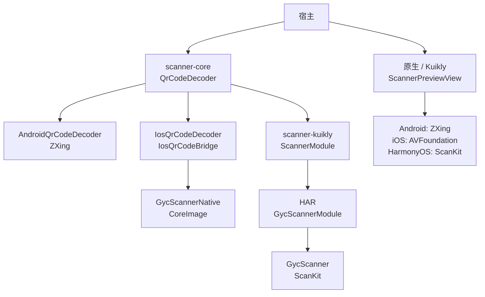
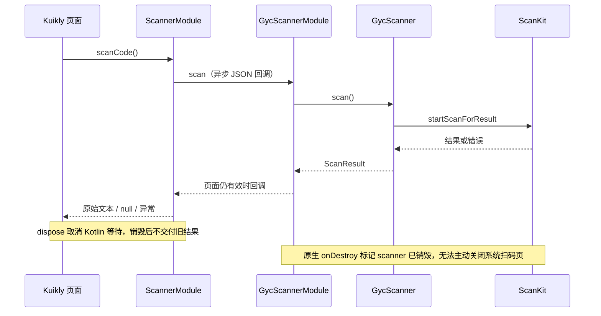
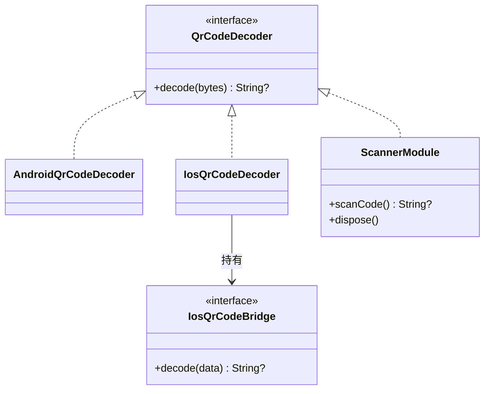

# GY CrossKit Scanner

二维码图片解码、Android/iOS 原生相机预览和 HarmonyOS ScanKit 系统扫码。返回原始文本；业务格式校验、扫码框、提示、导航和图片选择由宿主负责。

## 0.1.5 prerelease

Kuikly 图片解码和系统扫码等待被后台取消时，回调清理派回调用时的页面 dispatcher，并避免注册期间取消导致重复注销。调用和销毁仍要求所属页面 Kuikly Context。

| 渠道 | 当前版本 | 状态 |
| --- | --- | --- |
| Maven core/Kuikly | 0.1.5 | prerelease 已发布，JitPack 制品审计通过；独立消费结果见验收文档 |
| HarmonyOS HAR | 0.1.3 | 原生源码未变，保持既有版本 |
| Swift Package GycScannerNative | 0.1.1 | 原生源码未变，保持既有精确版本 |

[0.1.5 Release](https://github.com/gycrosskit/scanner/releases/tag/0.1.5) 已提供固定 Maven 归档与 SHA256SUMS；JitPack 最终状态、精确 commit 和制品审计通过。源码回归、远程渠道限制及独立消费进度见 [0.1.5 远程发布验收](docs/0.1.5远程发布验收.md)，不代表生产宿主或真实设备验收通过。

## 0.1.4 prerelease

修复 Kuikly scan/decode 回调已完成但协程尚未消费时页面销毁的迟交付，保留请求归属和 native cancel。新 POM 补齐 Apache-2.0 元数据。

| 渠道 | 本轮版本 | 状态 |
| --- | --- | --- |
| Maven core/Kuikly | 0.1.4 | JitPack 全文件/hash 与 Android/OHOS/三 iOS 编译、Simulator 链接通过 |
| HarmonyOS HAR | 0.1.3 | 原生源码未变，沿用旧 Release 已验产物 |
| Swift Package GycScannerNative | 0.1.1 | 原生源码未变，保持既有精确消费版本 |


## 平台与要求

| 平台 | 接入方式 | 系统要求 |
| --- | --- | --- |
| Android | KMP `scanner-core`，ZXing 图片解码与原生预览 | API 24+ |
| iOS | KMP 解码 bridge，或 Swift Package `GycScannerNative` | iOS 15+，Swift tools 5.9 |
| HarmonyOS | 原生 HAR，或 `scanner-kuikly` + HAR | 当前 HAR 的 target/compatible SDK 均为 API 22；需要设备提供 ScanKit |

Android/iOS 提供嵌入式预览；HarmonyOS 稳定版提供系统扫码页，0.1.3 候选另提供嵌入式预览。纯 OpenHarmony 设备不保证有 ScanKit，失败返回 `failed`。KMP 使用 Kotlin `2.2.21-1.0.0`，Kuikly 使用 `2.28.0-2.0.21-ohos`；OHOS 工具链配置见接入指南。

## 0.1.3 prerelease

- Android 既有 `ScannerPreviewView` 新增 `setFeedbackEnabled(enabled, vibrateEnabled = false)`；默认行为不变，宿主显式开启后由组件在一次有效结果上播放 ZXing 声音/可选振动。权限、状态栏样式和业务结果仍归宿主。
- HarmonyOS HAR 新增可直接注册的 `GycScannerPreviewView`，嵌入式 ScanKit Surface、进程唯一相机 owner、串行 init/start/stop/release 与帧代次由组件负责。旧 owner 成功 release 后新 View 才能 init；释放失败保留 owner 以便重试。
- `scanner-kuikly` 新增 `ScannerPreviewView` / `ScannerPreviewAttr` / `ScannerPreviewEvent` 和 DSL `ScannerPreview`，宿主 Compose 只装配布局和业务 callback。

[0.1.3 Release](https://github.com/gycrosskit/scanner/releases/tag/0.1.3) 提供固定 Maven/HAR 与 SHA256SUMS；JitPack 状态 `ok`，独立远程 Android/OHOS consumer 编译和 iOS Simulator Framework 最终链接通过。Release 下载 HAR 的 API 22 独立 consumer 编译通过；OHPM `next` 已接受审核，但精确版本查询与安装仍为 `NOTFOUND`，不能当作 Registry 可安装。历史验收保持对应版本，下面 Maven 安装示例为已发布的 `0.1.5` prerelease；独立原生渠道见兼容矩阵。

0.1.2 JitPack 因旧 Python 运行器解析失败；其标签和资产保留，使用修正安装入口的 0.1.3。真实声音/振动、Surface/ScanKit 与前后台仍需设备验收。完整接线见[接入指南](docs/接入指南.md#嵌入式预览与反馈)。

## 架构与调用流程

图片解码与相机预览是两个入口。`scanner-core` 提供 KMP 解码契约；iOS 由宿主接线 Swift bridge，HarmonyOS Kuikly 通过 HAR 调用 ScanKit。嵌入式预览按上方版本边界接入。



以下是 HarmonyOS 系统扫码页的调用，不是嵌入式预览。用户取消返回 `null`，设备或 SDK 失败进入错误出口；系统扫码页不能被组件强制关闭。



类图聚焦图片解码；`ScannerModule` 另外提供系统扫码入口，预览 View 独立维护相机生命周期。



源码：[QrCodeDecoder](scanner-core/src/commonMain/kotlin/io/github/gycrosskit/scanner/QrCodeDecoder.kt)、[Android 解码](scanner-core/src/androidMain/kotlin/io/github/gycrosskit/scanner/AndroidQrCodeDecoder.kt)、[iOS 解码与 bridge](scanner-core/src/iosMain/kotlin/io/github/gycrosskit/scanner/IosQrCodeDecoder.kt)、[Swift 解码](iosApp/Sources/GycScannerNative/QrCodeDecoder.swift)、[ScannerModule](scanner-kuikly/src/commonMain/kotlin/io/github/gycrosskit/scanner/kuikly/ScannerModule.kt)、[HAR Module](ohos/scanner-native/src/main/ets/GycScannerModule.ets)、[GycScanner](ohos/scanner-native/src/main/ets/GycScanner.ets)。预览：[Android](scanner-core/src/androidMain/kotlin/io/github/gycrosskit/scanner/ScannerPreviewView.kt)、[iOS](iosApp/Sources/GycScannerNative/ScannerPreviewView.swift)、[Kuikly](scanner-kuikly/src/commonMain/kotlin/io/github/gycrosskit/scanner/kuikly/ScannerPreviewView.kt)、[HAR](ohos/scanner-native/src/main/ets/GycScannerPreviewView.ets)。

## 安装

```kotlin
// settings.gradle.kts
dependencyResolutionManagement {
    repositories {
        exclusiveContent {
            forRepository {
                maven("https://mirrors.tencent.com/nexus/repository/maven-tencent/")
            }
            filter { includeGroup("com.tencent.kuikly-open") }
        }
        maven("https://jitpack.io")
        maven("https://maven.eazytec-cloud.com/nexus/repository/maven-public/")
        google()
        mavenCentral()
    }
}
```

```kotlin
commonMain.dependencies {
    implementation("com.github.gycrosskit.scanner:scanner-core:0.1.5")
}
ohosArm64Main.dependencies {
    implementation("com.github.gycrosskit.scanner:scanner-kuikly:0.1.5")
}
```

iOS 在 Xcode 的 Package Dependencies 添加 `https://github.com/gycrosskit/scanner.git`，选择精确版本 `0.1.1`，产品 `GycScannerNative`。

HarmonyOS 原生包独立安装：

```sh
ohpm install @gycrosskit/scanner-native@0.1.1
```

## 最小使用

```kotlin
import io.github.gycrosskit.scanner.*

// 协程内解码图片；未识别或无效图片返回 null，取消继续传播。
val text = AndroidQrCodeDecoder.decode(imageBytes)
// 主线程创建；先获得 CAMERA 权限。
val preview = ScannerPreviewView(activity, onFailure = { error ->
    // 宿主展示失败。
}) { rawText ->
    // 宿主校验并使用原始文本。
}
preview.setRunning(true)
// 页面离开或应用进入后台：
preview.setRunning(false)
// 页面永久销毁：
preview.release()
```

iOS 使用 `QrCodeDecoder.decode(data:)` 和 `ScannerPreviewView`；HarmonyOS 使用 `GycScanner(context).scan()` / `decode(bytes)`。平台完整示例见接入指南。

## 权限与边界

宿主先申请相机权限；Android CAMERA 声明由 AAR 合并，iOS Info.plist 需填写 `NSCameraUsageDescription`。预览主线程操作，一次启动只返回一个结果，继续扫描由宿主显式启动。Android/iOS 退出页面或后台时暂停，销毁时释放相机。

HarmonyOS 同实例只允许一个系统扫码请求；销毁时 `dispose()` 取消挂起回调。ScanKit 无主动关闭系统扫码页的接口；图片解码临时文件在 finally 清理，桥接图片上限 32 MiB，Base64 会额外占用内存。

不提供一维条码、多码选择、连续扫描、独立图片选择器或状态栏修改。编译与契约检查不代替真实设备相机、权限拒绝、前后台切换和二维码识别验收。

## 文档与帮助

- [接入指南](docs/接入指南.md)：平台初始化、权限声明和生命周期。
- [开发与验证](docs/开发与验证.md)：源码构建、检查命令与验收范围。
- [M13 候选验收](verification/嵌入式扫码候选验收.md)：本地测试、完整归档与未验收边界。
- [版本与发行说明](https://github.com/gycrosskit/scanner/releases)、[问题反馈](https://github.com/gycrosskit/scanner/issues)。

Apache-2.0，见 [LICENSE](LICENSE)。

本轮状态见 [0.1.5 远程发布验收](docs/0.1.5远程发布验收.md)；既有制品与远程记录见 [0.1.4 发布验收](docs/发布验收-0.1.4.md)。
